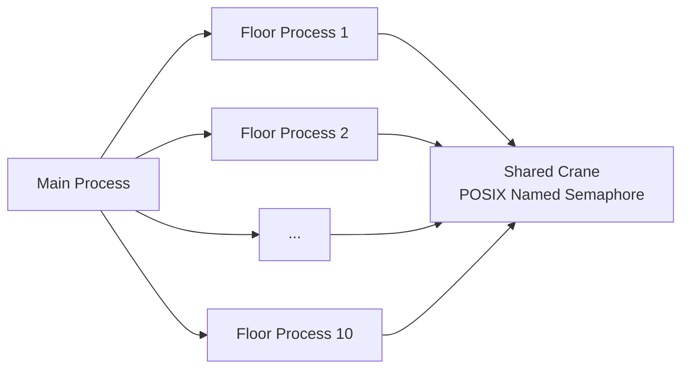
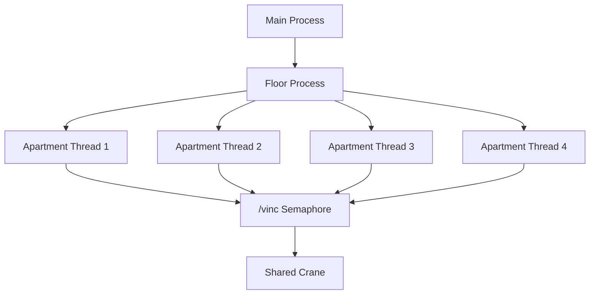
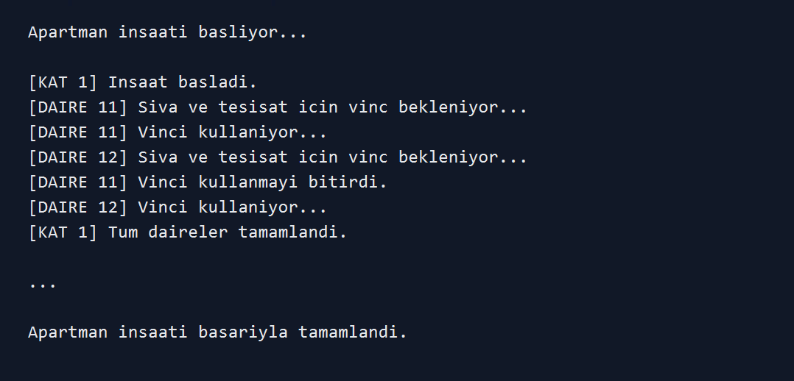

<h1 align="center">Multi-Story Building Simulation</h1>

<p align="center">
A C-based operating systems simulation that models apartment construction with processes, threads, and POSIX semaphores.
</p>

<p align="center">
  
  
  
  
  
  
</p>

---

## Project Overview

This project simulates the construction of a multi-story apartment building as
an educational demonstration of core **Operating Systems** concepts.

The simulation represents:

- each **floor** as a separate process
- each **apartment unit** on a floor as an individual thread
- a shared **crane** resource controlled by a named POSIX semaphore

The purpose of the project is to show how processes, threads, and semaphores can
work together in a simple real-world inspired scenario.



---

## Problem Scenario

In a building construction site, multiple apartment units may need access to the
same crane for operations such as plastering and installation work. Since the
crane is a shared resource, only one apartment unit should use it at a time.

This project models that synchronization problem using a POSIX named semaphore.

### Simulation Rules

- The building has `10` floors.
- Each floor has `4` apartment units.
- A floor is handled by a child process created with `fork`.
- Apartment units are handled by POSIX threads created with `pthread_create`.
- The crane is protected by the `/vinc` named semaphore.
- An apartment thread must wait for the semaphore before using the crane.
- After crane usage is finished, the semaphore is released.

---

## Technologies Used

| Technology | Purpose |
|-----------|---------|
| C | Main implementation language |
| POSIX Process API | Creating child processes with `fork` |
| POSIX Threads | Creating apartment-level worker threads |
| POSIX Semaphores | Synchronizing access to the shared crane |
| GCC | Compiling the program on Linux/POSIX systems |

---

## Project Structure

```text
MultiStoryBuilding_Sim_OS_Processes_Threads_Semaphores/
|-- building_simulation.c
|-- README.md
|-- LICENSE
`-- assets/
    `-- screenshots/
```

---

## Main Components

| Component | Responsibility |
|----------|----------------|
| `main` | Initializes the named semaphore and starts the floor construction flow |
| `fork` | Creates a separate process for a floor |
| `kat_insa_et` | Runs the apartment thread workflow for a floor |
| `pthread_create` | Starts one thread for each apartment unit |
| `daire_islemi` | Represents the apartment work that needs crane access |
| `sem_wait` | Locks the shared crane before usage |
| `sem_post` | Releases the shared crane after usage |
| `sem_unlink` | Removes the named semaphore from the system |

---

## Process and Thread Model

The program uses a hierarchical execution model:

```text
Main process
   |
   v
Floor process
   |
   v
Apartment threads
   |
   v
Shared crane semaphore
```

Each floor process creates four apartment threads. The apartment threads run
concurrently within their floor process, but crane usage is serialized through
the semaphore.



---

## Synchronization Strategy

The crane is the critical shared resource in the simulation. It is represented
by a named POSIX semaphore:

```c
#define SEM_VINC "/vinc"
```

Before using the crane, an apartment thread waits on the semaphore:

```c
sem_wait(vinc);
```

After the simulated crane operation is complete, the thread releases it:

```c
sem_post(vinc);
```

Because the semaphore is initialized with the value `1`, only one apartment
thread can use the crane at any given time.

---

## Execution Flow

1. The main process removes any previously existing `/vinc` semaphore.
2. A new named semaphore is created for the shared crane.
3. The program starts the construction simulation.
4. For each floor, a child process is created.
5. The floor process creates four apartment threads.
6. Apartment threads wait for crane access.
7. Only one thread uses the crane at a time.
8. Threads finish and the floor process exits.
9. The main process cleans up the semaphore.

---

## Platform Notes

This project is designed for **Linux/POSIX-compatible environments**.

It uses APIs such as:

- `fork`
- `unistd.h`
- `pthread`
- `sem_open`
- `sem_wait`
- `sem_post`

Because of these dependencies, the program is not intended to run directly on
native Windows command prompt or PowerShell. On Windows, use **WSL** or a Linux
virtual machine.

---

## How to Run

Compile the program:

```bash
gcc building_simulation.c -o building_simulation -pthread
```

Run the simulation:

```bash
./building_simulation
```

If your Linux environment requires linking the realtime library for named
semaphores, use:

```bash
gcc building_simulation.c -o building_simulation -pthread -lrt
```

---

## Sample Console Output



---

## Educational Focus

This project demonstrates:

- process creation and parent-child process control
- thread creation and joining
- shared resource synchronization
- semaphore-based mutual exclusion
- basic cleanup of system-level synchronization objects

It is intentionally small and focused so that the operating systems concepts are
easy to identify in the source code.

---

## Limitations and Future Work

- Floor processes are created one by one in the current implementation because
  the parent process waits after each `fork`.
- The construction workload is simulated with `sleep`.
- The number of floors and apartments is fixed with preprocessor constants.
- Error handling can be expanded for more detailed diagnostics.
- A Makefile can be added for a cleaner build workflow.
- A future version could allow all floor processes to run concurrently and then
  wait for them after creation.

---

## Developer

**A. Furkan ÖCEL**

---

## License

This project is licensed under the terms included in the repository's `LICENSE` file.
